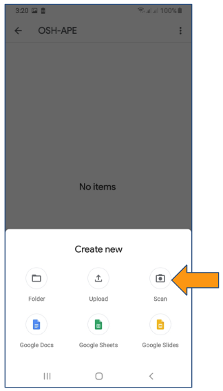
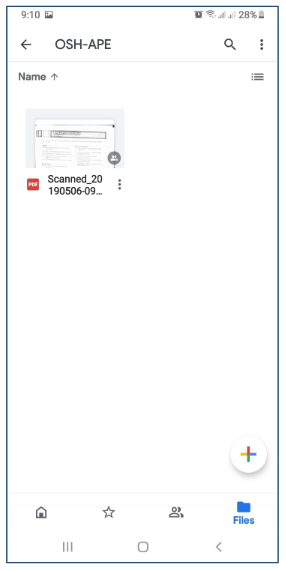

# How to upload your Annual Physical Exam (APE) results to your OSH-APE folder

## Contents

[How to make a shortcut in your smartphone to quickly access your APE folder](#how-to-make-a-shortcut-in-your-smartphone-to-quickly-access-your-ape-folder)

[Uploading in your smartphone](#uploading-in-your-smartphone)
* [Uploading Soft Copies With Downloading](#uploading-soft-copies-with-downloading)
* [Uploading Soft Copies Without Downloading](#uploading-soft-copies-without-downloading)
* [Uploading Hard Copies](#uploading-hard-copies)

[Uploading in your desktop](#uploading-in-your-desktop)

***

## How to make a shortcut in your smartphone to quickly access your APE folder

***

|  | * Tap on the link in your **OSH email** |
|------|------|

<!-- * Tap on the link in your **OSH email**

 -->

|  | * Tap on the three vertical dots at the upper right corner of the screen |
|------|------|

<!-- * Tap on the three vertical dots at the upper right corner of the screen

 -->

|  | * Tap on the **Add to Starred** option in the menu that appears, then tap on the **Add to Home screen** option |
|------|------|

<!-- * Tap on the **Add to Starred** option in the menu that appears, then
* Tap on the **Add to Home screen** option

 -->

|  | * Tap on **Add** in the following dialog |
|------|------|

<!-- * Tap on **Add** in the following dialog

 -->

|  | * A message will appear showing the operation was successful |
|------|------|

<!-- * A message will appear showing the operation was successful

 -->

|  | * The OSH-APE shortcut is created as an icon in your home screen. Tapping it will direct your Google Drive directly to your OSH-APE folder |
|------|------|

<!-- * The OSH-APE shortcut is created as an icon in your home screen. Tapping it will direct your Google Drive directly to your OSH-APE folder

 -->

***

## Uploading in your smartphone

***

### 2 Ways to Upload in Your Smartphone

* Uploading soft copies (PDFs) with and without downloading
* Uploading hard copies (Printouts)

### Uploading Soft Copies With Downloading

* Open your Gmail app in your phone and find the email where your APE results are attached and open the email

* Tap on the **Download icon** for all files you want to download

* Tap the OSH-APE shortcut in your home screen. Your Google Drive will open to your OSH-APE folder location.

* Tap the **+ button**

* Tap on **Upload**

* Find and select the files you want to upload and tap on **Open**

* Files uploaded to **OSH-APE** folder

### Uploading Soft Copies Without Downloading

* Open your Gmail app in your phone and find the email where your APE results are attached and open the email

* Tap on the **Google Drive icon**

* Tap on **Organise**

* Tap on **Back Arrow**

* Tap on **Starred**

* Tap on **OSH-APE**

* Tap on **SELECT**

* Files uploaded to **OSH-APE** folder

### Uploading Hard Copies

* Icon in home screen to your OSH-APE folder

* Tap the **+ button**

* Tap on **Scan**

* Point the camera at the document you want to scan (make sure the background is darker than the document) then press the **circle button** as if taking a picture

* Tap on **OK**

* Tap on the **+** to add another page to the scanned document

* Point the camera at the page you want to scan and add (make sure the background is darker than the document) then press the **circle button** as if taking a picture. Do the same for additional pages.

* Tap on **OK**

* Tap on **the check** to upload the document

* The uploaded scanned document

***

## Uploading in your desktop

***

* Tap on the link in your **OSH email**

* Tap on the **New** button

* Tap on the **File upload** option on the drop down menu

* Select **all the files** you want to upload and tap on the **Open button**

* Uploaded documents

..
